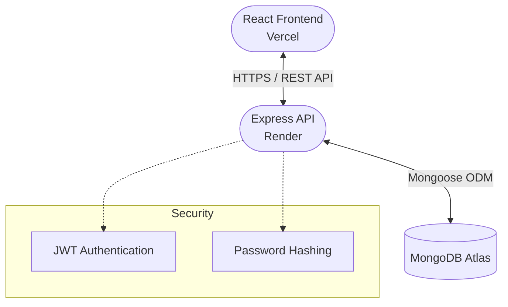
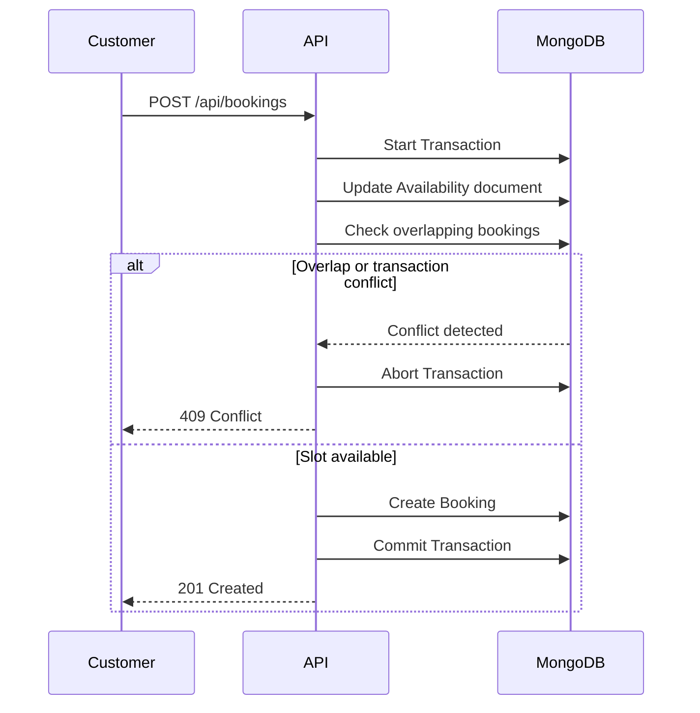

# ServiceHub - Multi-Service Booking & Management Platform

ServiceHub is a full-stack marketplace that connects customers with service providers for services such as home maintenance, tutoring, repairs, and other local services.

## Links

- **Live Frontend:** https://service-hub-beta-eight.vercel.app
- **Live Backend API:** https://servicehub-api-qm37.onrender.com
- **GitHub Repository:** https://github.com/ShreyasPSoori/ServiceHub

---

## User Roles & Features

### Customer

- **Service Discovery:** Browse, search, and filter available services.
- **Booking Management:** Schedule appointments, view bookings, and cancel upcoming bookings.
- **Reviews:** Leave ratings and reviews for completed services.

### Service Provider

- **Service Management:** Create, edit, and delete service listings.
- **Service Images:** Add a service image URL with fallback handling for unavailable images.
- **Availability:** Define weekly working hours to control booking windows.
- **Booking Workflow:** Accept, reject, and complete customer bookings.
- **Reviews:** View reviews associated with their services.

### Administrator

- **Dashboard:** View system-wide statistics and KPIs.
- **User Management:** Activate or deactivate users using soft deactivation while preserving historical records.
- **Service Management:** Manage service listings across the platform.
- **Booking Management:** View and manage bookings across the system.
- **Review Management:** Moderate reviews.

---

## Tech Stack

### Frontend
- React
- Vite
- React Router
- JavaScript
- CSS

### Backend
- Node.js
- Express.js
- REST APIs
- JWT Authentication
- bcrypt

### Database
- MongoDB Atlas
- Mongoose

### Deployment
- Vercel - Frontend
- Render - Backend
- MongoDB Atlas - Database

---

## System Architecture



The frontend communicates with the Express REST API over HTTPS. The backend handles authentication, authorization, business logic, booking validation, and database operations through Mongoose.

---

## Technical Highlight: Concurrency Protection

A booking platform must prevent two customers from successfully booking the same provider and time slot when requests arrive concurrently.

ServiceHub implements concurrency protection using MongoDB transactions and a write-conflict/serialization point on the provider's availability document.

### Booking Protection Flow

1. **Transaction:** Booking creation runs inside a MongoDB transaction.
2. **Serialization Point:** The transaction updates the provider's `Availability` document for the requested day. This creates a write-conflict point when concurrent transactions attempt to book the same provider/day.
3. **Overlap Validation:** Existing bookings are checked for overlapping time intervals.
4. **Conflict Handling:** If a concurrent transaction has already taken the slot, the losing request is handled as a conflict and returns HTTP `409 Conflict`.
5. **User Feedback:** The API returns:

   > This time slot was just booked by another customer. Please choose another time.

6. **Compound Index:** The booking collection uses the following index to efficiently locate matching bookings during validation:

```text
{ providerId: 1, bookingDate: 1, status: 1 }
```

### Booking Workflow



This prevents the application from relying only on a simple check-then-create pattern, which can allow concurrent requests to pass the availability check before either booking is created.

---

## Database Models

### User

Stores:

- Name
- Email
- Password hash
- Role
- Phone
- Profile information
- Active status
- Account creation date

Supported roles:

```text
customer
provider
admin
```

### Service

Stores:

- Provider
- Title
- Description
- Price
- Category
- Duration
- Service image
- Active status

### Availability

Stores:

- Provider
- Day of week
- Availability status
- Start time
- End time

### Booking

Stores:

- Customer
- Provider
- Service
- Booking date
- Start time
- End time
- Booking status
- Payment status
- Notes
- Creation date

Booking statuses:

```text
pending
accepted
rejected
cancelled
completed
```

Payment statuses:

```text
pending
paid
refunded
```

### Review

Stores:

- Customer
- Provider
- Service
- Completed booking
- Rating
- Comment
- Creation/update timestamps

Each completed booking can have one associated review.

---

## Authentication & Security

ServiceHub implements several application-level security mechanisms:

- JWT-based authentication
- Role-based authorization
- bcrypt password hashing
- Protected API routes
- Environment variables for secrets
- Production CORS configuration
- Production error-message masking
- Soft deactivation of users
- Authentication checks against the current active user account

Inactive users cannot continue using authenticated sessions after their account has been deactivated.

---

## Local Setup & Installation

### Prerequisites

- Node.js 18.x or 20.x
- MongoDB Atlas account or a local MongoDB instance
- Git

### 1. Clone the Repository

```bash
git clone https://github.com/ShreyasPSoori/ServiceHub.git
cd ServiceHub
```

### 2. Backend Setup

```bash
cd Backend
npm install
```

Create a `.env` file inside the `Backend` directory:

```env
PORT=5000
MONGO_URI=mongodb+srv://<your_username>:<your_password>@<cluster>.mongodb.net/ServiceHub
JWT_SECRET=your_secret_key
NODE_ENV=development
FRONTEND_URL=http://localhost:5173
```

Start the backend:

```bash
npm start
```

The backend runs on:

```text
http://localhost:5000
```

### 3. Frontend Setup

Open another terminal:

```bash
cd Frontend
npm install
```

Create a `.env` file inside the `Frontend` directory:

```env
VITE_API_URL=http://localhost:5000/api
```

Start the frontend:

```bash
npm run dev
```

The frontend will normally run on:

```text
http://localhost:5173
```

---

## Project Structure

```text
ServiceHub/
|
|-- Backend/
|   |-- config/
|   |   `-- Database connection
|   |
|   |-- controllers/
|   |   `-- Business logic and request handling
|   |
|   |-- middlewares/
|   |   `-- Authentication and authorization
|   |
|   |-- models/
|   |   `-- Mongoose schemas
|   |
|   |-- routes/
|   |   `-- Express API routes
|   |
|   |-- scripts/
|   |   `-- Demo data seed scripts
|   |
|   |-- index.js
|   |   `-- Backend entry point
|   |
|   `-- package.json
|
|-- Frontend/
|   |
|   |-- public/
|   |   `-- Static assets
|   |
|   |-- src/
|   |   |
|   |   |-- components/
|   |   |   `-- Reusable UI components
|   |   |
|   |   |-- context/
|   |   |   `-- React authentication context
|   |   |
|   |   |-- pages/
|   |   |   `-- Application pages and dashboards
|   |   |
|   |   |-- App.jsx
|   |   |   `-- Application routing
|   |   |
|   |   `-- index.css
|   |       `-- Global styling
|   |
|   |-- vite.config.js
|   `-- package.json
|
`-- README.md
```

---

## Deployment

### Frontend - Vercel

The React frontend is deployed using Vercel.

Build command:

```bash
npm run build
```

Required environment variable:

```env
VITE_API_URL=https://servicehub-api-qm37.onrender.com/api
```

Live frontend:

https://service-hub-beta-eight.vercel.app

### Backend - Render

The Express backend is deployed using Render.

Start command:

```bash
npm start
```

Required production environment variables:

```env
MONGO_URI=<production MongoDB connection string>
JWT_SECRET=<production JWT secret>
FRONTEND_URL=https://service-hub-beta-eight.vercel.app
NODE_ENV=production
```

The backend uses production CORS configuration so that requests are accepted from the configured frontend origin rather than allowing unrestricted origins.

Live backend:

https://servicehub-api-qm37.onrender.com

### Database - MongoDB Atlas

MongoDB Atlas hosts the production ServiceHub database.

The application connects to the `ServiceHub` database through the backend using Mongoose.

---

## Screenshots

Screenshots will be added to the repository under:

```text
docs/screenshots/
```

Planned screenshots include:

- Homepage
- Services marketplace
- Service details and booking
- Customer bookings
- Provider dashboard
- Provider booking management
- Admin dashboard

---

## Future Enhancements

- **Integrated Payments:** Add Stripe or Razorpay for online booking payments.
- **Real-Time Notifications:** Use WebSockets or push notifications to notify providers about new bookings and status changes.
- **Cloud Image Storage:** Replace external image URLs with image uploads using Multer and storage such as Cloudinary or Amazon S3.
- **Geospatial Search:** Use MongoDB geospatial queries such as `$geoNear` to find services based on location or search radius.
